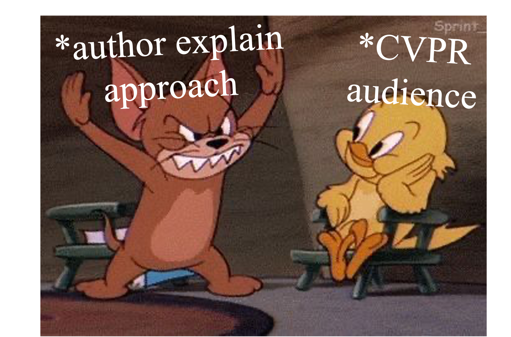
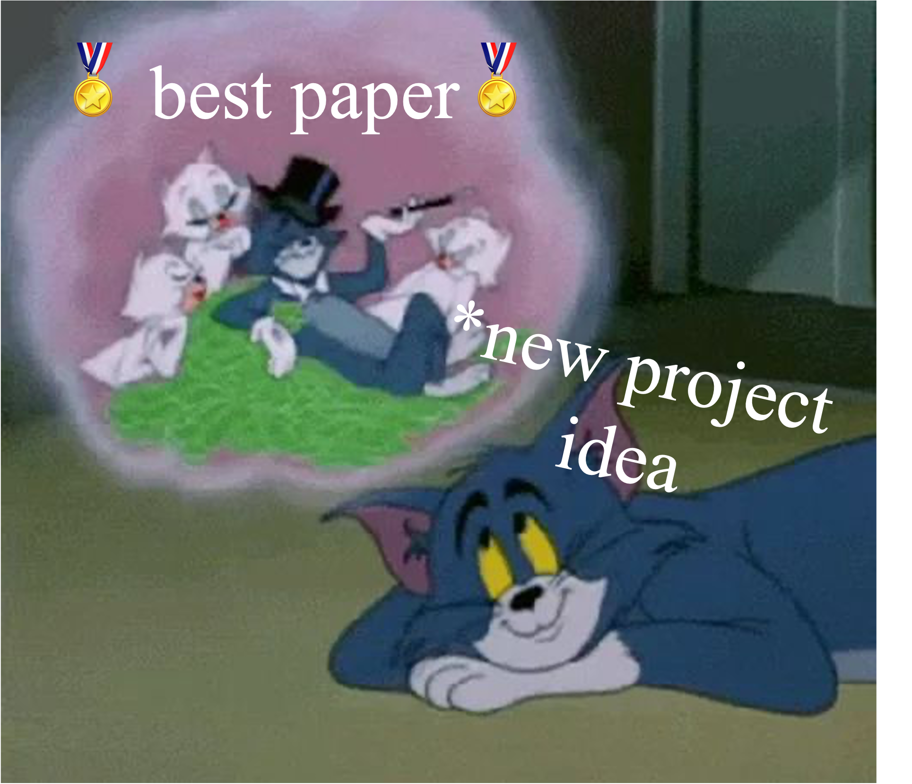
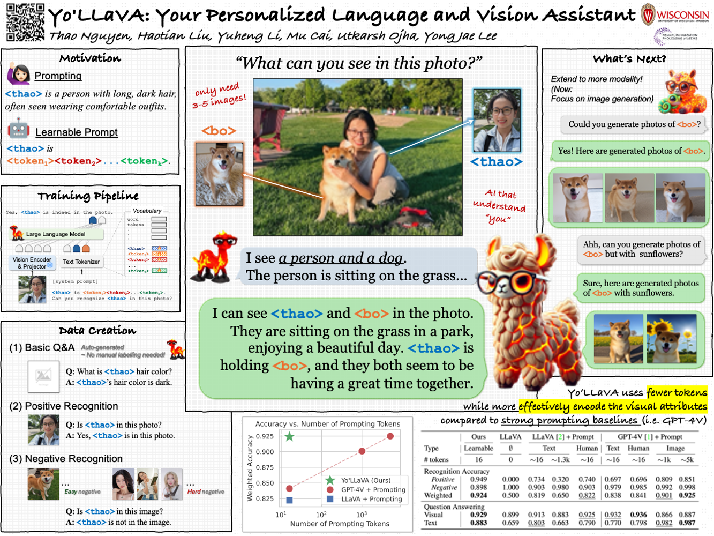
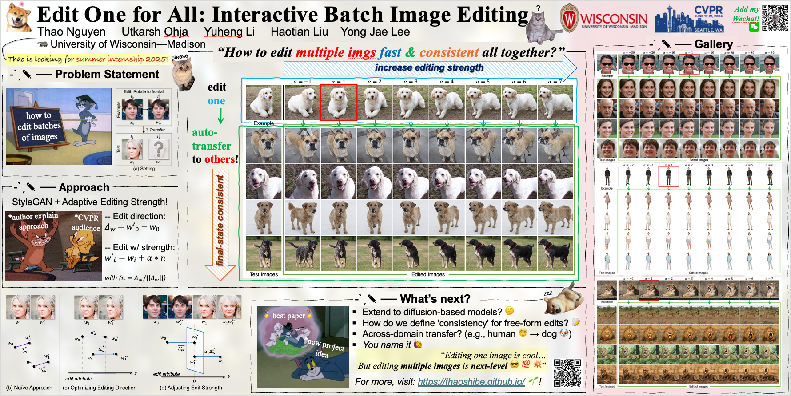
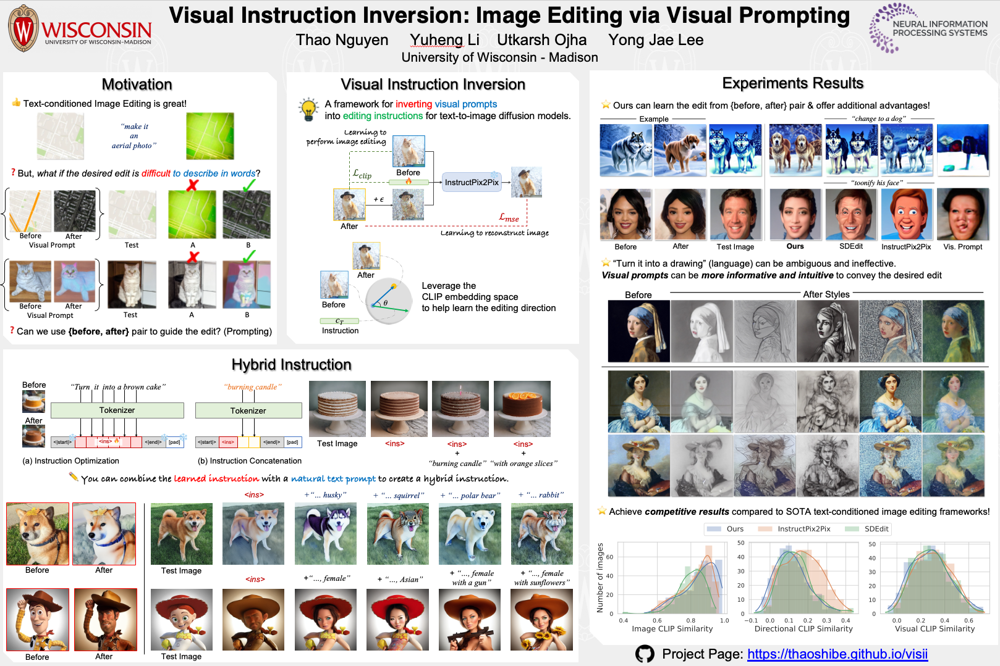
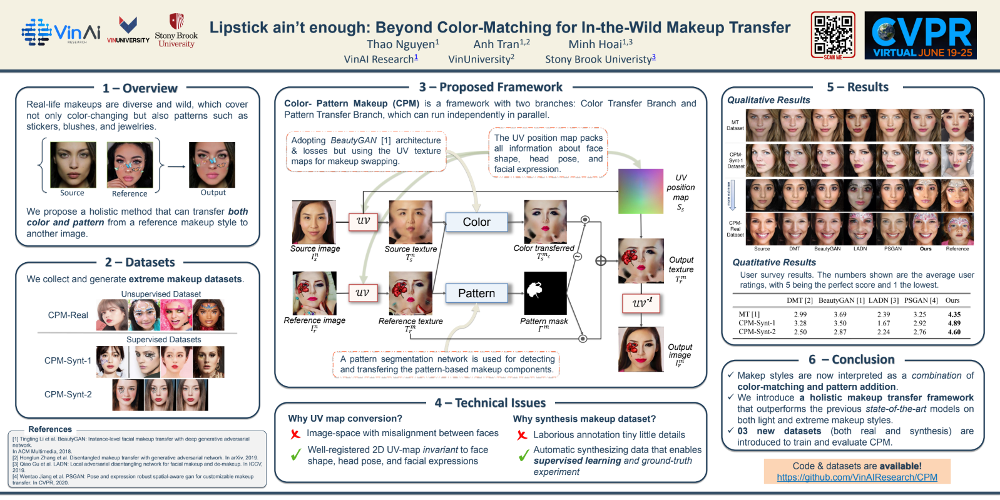

# 📝 Posters, Posters, Posters!

This is *a collection of all the conference posters* I’ve created over the years.

I’ve been fortunate enough to present my work at several conferences, and each time, I put a lot of effort into making the poster.

Unfortunately, most posters tend to be forgotten just minutes after the session ends… 😅📉

---

But I’ve decided not to let all that hard work go to waste!

✨ I’m gathering them all in one place so I can look back and see how I’ve grown—both professionally and with a bit of humor, haha! 🌱📈

No -- I have decided that I will not let my hard work go to waste.
Or at least, I'd keep all the posters in one place, so that I can look back and see how I have improved over the years (both professionally and funny side, hahahaa)

Okie~ Let's get started 🚀

## 📚 Table of Contents

1. [NeurIPS 2024 (in progress)](#neurips-2024)
2. [CVPR 2024](#cvpr-2024)
3. [NeurIPS 2023](#neurips-2023)
4. [CVPR 2021](#cvpr-2021)

### NeurIPS 2024

- Paper: *Yo'LLaVA: Your Personalized Language and Vision Assistant*
- Authors: Thao Nguyen, Haotian Liu, Yuheng Li, Mu Cai, Utkarsh Ojha, Yong Jae Lee
- Page: [https://thaoshibe.github.io/YoLLaVA/](https://thaoshibe.github.io/YoLLaVA/)
- Poster PPTX: [here](./pptx/yollava-poster-neurips2024.pptx)

### CVPR 2024

- Paper: *Edit One for All: Interactive Batch Image Editing*
- Authors: Thao Nguyen, Utkarsh Ojha, Yuheng Li, Haotian Liu, Yong Jae Lee
- Page: [https://thaoshibe.github.io/edit-one-for-all/](https://thaoshibe.github.io/edit-one-for-all/)
- Poster PPTX: [here](./pptx/Nguyen_8831_CVPR2024-poster.pptx)

### NeurIPS 2023

- Paper: *Visual Instruction Inversion: Image Editing via Visual Prompting*
- Authors: Thao Nguyen, Yuheng Li, Utkarsh Ojha, Yong Jae Lee
- Page: [https://thaoshibe.github.io/visii/](https://thaoshibe.github.io/visii/)
- Poster PPTX: [here](./pptx/NeurIPS2023-Poster.pptx)

### CVPR 2021

- Paper: *Lipstick ain't enough: Beyond Color Matching for In-the-Wild Makeup Transfer*
- Authors: Thao Nguyen, Anh Tran, Minh Hoai
- Page: [https://thaoshibe.github.io/CPM](https://thaoshibe.github.io/CPM)

